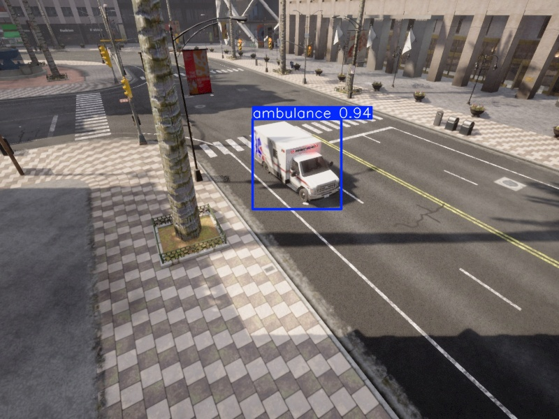

# Adaptive Traffic Signal Management for Emergency Vehicle Priority

An intelligent transportation framework that prioritizes emergency vehicles (e.g. ambulances) at urban intersections. This is an **active, in-progress M.Sc. thesis project** — the sections below are labeled honestly by implementation status so the code always matches the description.



## Project Status

| Component | Status | What exists today |
|---|---|---|
| 🟢 **Adaptive Control Policy** | Implemented | A reward-based decision engine (`control/adaptive_policy.py`) that computes a queue-penalty + emergency-vehicle-distance penalty and decides whether to override the current signal phase. Logic is fully coded and unit-testable. |
| 🟡 **Perception Module** | Prototype | YOLO-based detection wrapper (`perception/detect.py`) using an off-the-shelf pretrained model. Not yet fine-tuned on a labeled emergency-vehicle dataset — accuracy has not been formally benchmarked. |
| 🟡 **CARLA–SUMO Co-simulation** | Mock / scaffolded | `simulation/traci_bridge.py` currently runs a **console-based mock simulation** (`run_simulation_demo`) with scripted queue and distance values, to validate the perception→control→action pipeline logic end-to-end before wiring in the real simulators. Real CARLA/SUMO integration is the next milestone. |
| ⚪ **Quantitative results (mAP, wait-time reduction, FPS)** | Not yet measured | No benchmark has been run yet. Numbers will be added here once a real evaluation is done — not before. |

## System Architecture (target design)

```
[ CARLA Simulator ] (CCTV Feed) --> [ YOLO Perception ] (Vehicle Detection)
        ^                                  |
        | (TraCI sync — in progress)       v
[ SUMO Traffic Flow ] <-- [ Adaptive Control Policy ] (Phase Decisions)
```

1. **Perception**: detects vehicles (incl. emergency vehicles) from a camera/video feed.
2. **Control**: an implemented reward function `R_t = -(Σ w_i·Q_i² + α·I(EV)/(D_ev+ε))` decides whether to hold or transition the signal phase.
3. **Simulation**: currently mocked with scripted values; real CARLA↔SUMO bridging is under active development.

## Repository Structure
- `control/` — adaptive signal control policy (implemented, see status table)
- `perception/` — YOLO-based vehicle detection wrapper (prototype)
- `simulation/` — CARLA/SUMO bridge (currently mock mode)
- `test_models.py` — quick manual script to sanity-check detections across candidate model weights on a single test image (not a formal evaluation)

## Quick Start (current mock pipeline)

```bash
git clone https://github.com/soheylfalahzade/adaptive-its-priority.git
cd adaptive-its-priority
python -m venv .venv && source .venv/bin/activate
pip install -r requirements.txt
python app.py
```

This runs the mock console demo showing how perception output would feed into the adaptive control decision — useful for reviewing the decision logic before the full simulator integration is complete.

## Roadmap
- [ ] Fine-tune YOLO on a labeled emergency-vehicle dataset and report real precision/recall/mAP
- [ ] Replace mock simulation loop with real CARLA↔SUMO TraCI synchronization
- [ ] Run controlled experiments comparing adaptive control vs. fixed-time baseline and report measured wait-time reduction
- [ ] Add automated tests for the control policy

## Thesis Context
This repository supports my ongoing M.Sc. thesis at Yazd University, *"Adaptive Traffic Signal Management with ML-Driven Fleet Prioritization"* (advised by Dr. Mohammad Farshi and Dr. Saeed Alikhani). Results here reflect current development progress, not final thesis outcomes.
